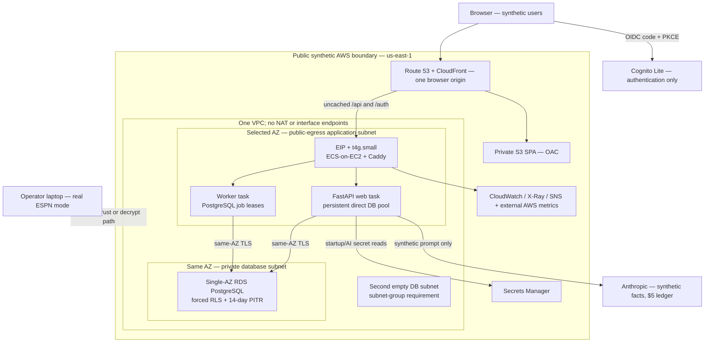

# ESPN Edge — system architecture authority map

Status: **target-architecture index; design only**. This file does not authorize production code,
AWS creation, migration, live ESPN traffic, data deletion, or model spend. The accepted Sprint 9
documents under [`docs/sprint-9/`](docs/sprint-9/) contain the evidence and decision detail; this
file keeps agents from turning those records into a second, contradictory architecture.

Last reconciled: 2026-08-12.

## The directive, with premise corrections

Build a portfolio-grade, production-disciplined sports analytics system. Do not describe the
accepted target as a commercial SaaS for strangers: the hosted system contains **synthetic tenants
only**, while real ESPN data and credentials remain in a separately operated local-private mode.
That boundary is a security control, not a feature flag.

“Google-level” and “Apple-level” are aspirations, not testable acceptance criteria. In this
repository they mean measurable system invariants, economical failure choices, accessible and
predictable interaction behavior, and evidence that another engineer can reproduce. They do not
mean copying another company's topology or visual style.

Three requested domain labels also overstate the product:

| Requested label | Current/accepted boundary |
| --- | --- |
| Real-Time Stats Ingestion | **Scheduled and operator-triggered ingestion.** The real private provider has one global request-start permit per second and may be stale. Public jobs use synthetic fixtures and never call ESPN. |
| Roster Optimization Engine | **Roster intelligence and deterministic analytics.** The system measures roster strength, lineup efficiency, opportunity and exposure; it does not currently prescribe or execute lineup moves. |
| Trade Analysis | **Advisory only.** It may explain a proposal, but never executes an ESPN write or feeds model output back into metrics. |

## Authority and conflict resolution

This repository uses a federated SSOT because one document cannot honestly describe both the
running local system and a gated target.

| Question | Authority | Conflict rule |
| --- | --- | --- |
| What does the system do now? | Code, tests and measured evidence in [`00-current-state.md`](docs/sprint-9/00-current-state.md) | **Code wins** over `SPEC.md`; record drift rather than silently implementing intent. |
| What product was intended? | [`SPEC.md`](SPEC.md), subject to accepted corrections | Intent does not authorize a change. Section 11 provider guardrails remain mandatory. |
| What architecture is selected? | This index, [`03-architecture.md`](docs/sprint-9/03-architecture.md) and its accepted ADRs | The ADR carries options, price, accepted failure and revisit trigger. Amend the ADR to change a decision. |
| What may be built next? | One operator-accepted `docs/phase-N-name.md` at an immutable SHA | No accepted phase contract means no implementation. A material contract amendment repeats review and acceptance. |
| What proves a claim? | CI output and an E-numbered measurement ledger | Label values measured, derived, externally verified, assumed or unmeasurable. Model agreement is not evidence. |

Standing constraints are the `$100–150/month` AWS hard ceiling, solo operation, synthetic-only
hosting, no public credential custody, one production writer, offline tests by default, and boring,
cheap, reversible choices. The current risk-sequenced program is
[`06-phases.md`](docs/sprint-9/06-phases.md), not the historical phases in `SPEC.md`.

## Part A — purpose, experience language and service objectives

### System purpose and operating modes

ESPN Edge consolidates multi-league fantasy-football facts into deterministic portfolio, league,
draft, opportunity, lineup and advisory views. AI explains bounded facts; it is never the source of
metric truth.

| Mode | Purpose | Data/provider boundary | Deployment |
| --- | --- | --- | --- |
| Public synthetic | Demonstrate authentication, authorization, forced-RLS tenant isolation, fair durable jobs, recovery, observability and cost controls. | Synthetic people, leagues, athletes and events only; synthetic facts only may reach Anthropic. No ESPN client, cookie, raw capture, real report or custody decrypt path exists. | Selected AWS target. |
| Private operator | Analyze the operator's own ESPN leagues while accepting the documented provider-contract and third-party-data risk. | Real cookies in OS custody; read-only JSON calls through the one global limiter; real member identifiers follow the accepted field-disposition policy. | Remains local. The private AWS module is designed but not approved or applied. |

### Experience language

Preserve the product's existing “Cold Front” draft-room identity and canonical tokens in
[`web/src/tokens.css`](web/src/tokens.css). Apply human-interface principles rather than visual
imitation:

- a clear primary action and information hierarchy on every screen;
- immediate local feedback within 100 ms for taps, sorting, expansion and optimistic-free loading
  state changes; this is not a promise that network data returns in 100 ms;
- keyboard reachability, visible focus, semantic labels, reduced-motion behavior, 44-by-44 CSS-pixel
  touch targets where touch interaction is expected, and WCAG 2.2 AA contrast;
- stable spatial layout during loading, explicit empty/stale/error/permission states, and no
  decorative animation that competes with numerical comparison;
- tabular numerals and backend-computed analytics. React formats and presents; it does not create a
  second analytics implementation;
- one same-origin browser surface. JavaScript never reads the opaque application session or
  identity-provider tokens.

These are requirements to verify in Phase 40, not claims that the current UI already meets every
item.

### Targets, budgets and accepted failures

| Property | Target/guard | Trade-off and accepted failure |
| --- | --- | --- |
| Availability | **99.0% target**, not a customer SLA | Approximately 7.3 hours/month of downtime is compatible with the arithmetic target. One host, one database AZ and operator-only recovery are accepted; no additional “nine” is purchased. |
| Cutover | Reversible candidate/prior slot where Phase 34 proves memory; otherwise staged drain | “Zero downtime” describes a possible cutover technique only. It is not an availability promise. |
| Public relational RPO | **≤5 minutes** through RDS PITR, measured by `LatestRestorableTime` | Covers the cache-free relational closure, not Cognito. |
| Private-local RPO | **≤1 hour only while the laptop and off-device target are available**; show actual backup age and stop protected writes at 24 hours | Sleep/disconnected storage weakens the actual RPO. The displayed age is truth. |
| Infrastructure RTO | **≤4 operator-hours after detection** | No overnight on-call. Cognito loss is outside this target and may require manual re-enrolment/re-linking for up to two business days. |
| Read performance | Four profiled warm reads: **p95 ≤750 ms and ≤25 SELECTs** under the non-owner forced-RLS role | Phase 33 may reject feasibility. The requirement is not relaxed inside the production refactor. |
| Export | First byte ≤1 second and peak RSS ≤256 MiB | Stream JSON/CSV and bound XLSX/temp/concurrency; an export may restart rather than resume. |
| Provider capacity | One global ESPN request start/second across private accounts; increasing workers never increases it | Data can become stale and work can queue. Public capacity tests use synthetic jobs. |
| AI spend | Hard **$5 UTC-calendar-month** authoritative reserve/settle ledger | On ambiguity or trip, generation becomes cached-only; availability is sacrificed before wallet safety. |
| Recurring cost | Expected public target **$34.26 AWS + $5 external = $39.26/month**; operating envelope **$51.76/month** | Current prices are snapshots, not eternal facts. Any new or variable path needs a line item and guard before apply. |

## Part B — domain boundaries

This remains a modular monolith plus worker, not a microservice estate. Domain boundaries guide
schemas, transactions and ownership; they are not a reason to buy a network hop.

| Domain | Owns | Invariants / does not own |
| --- | --- | --- |
| Identity and tenancy | External identity mapping, users, tenants, memberships, opaque sessions, CSRF and authorization policy | Cognito authenticates; PostgreSQL memberships authorize. A guessed ID or Cognito group is never authority. Tenant facts use transaction-local context, composite tenant FKs and forced RLS under non-owner runtime roles. |
| League portfolio | Accounts, leagues, teams, rosters, matchups, drafts and transactions | A league cannot be repointed across tenants. Real owner identifiers are never part of public fixtures. |
| Provider ingestion | Provider adapters, parse/schema-drift checks, checkpoints and cache policy | Private ESPN access is backend-only, read-only and globally rate-limited. Public mode cannot instantiate the ESPN adapter. This is scheduled ingestion, not streaming. |
| Analytics and snapshots | Deterministic metrics, opportunity imports, Monte Carlo inputs/results and bounded history | AI output never becomes a metric. Raw snapshots retain 90 days, then weekly rollups, unless a later measured ADR changes policy. |
| Roster intelligence | Roster strength, lineup efficiency, exposure, draft strategy and opportunity views | No autonomous roster moves, waiver claims or lineup writes. A future optimizer requires a new product and provider-boundary decision. |
| Trade advisory | Proposal validation, deterministic facts and explanatory output | Advisory only; no trade execution and no invented facts. Hosted examples use synthetic data. |
| AI reports and spend | Prompt-version/input-hash cache, validated report schemas, usage reservations and authoritative settlement | Optional feature. Synthetic-only in public mode; existing real-data reports stay local and are not migration payload. |
| Work orchestration | Durable schedules, PostgreSQL leases, idempotency, fairness, retries, poison disposition and backpressure | At-least-once delivery is accepted. Jobs and outbox changes share a transaction; a worker never bypasses tenant context after claim. |
| Export, audit and recovery | Tenant-scoped exports/deletion evidence, append-only audit facts, cache-free backup manifests and restore canaries | Export is not authorization. Raw cache and credentials are excluded from the recovery closure. |

## Phase 1 cloud architecture blueprint

“Phase 1” here means the first public cloud deployment shape, not historical `SPEC.md` Phase 1.
The detailed decisions and verified 2026-08-09 prices are in
[`03-architecture.md`](docs/sprint-9/03-architecture.md).

Selected implementation directives:

- public-egress application subnet with restrictive security group, private RDS, one EIP and SSM;
  no SSH, NAT gateway, interface endpoint or ALB;
- one Arm `t4g.small` running Caddy, web and worker as ECS-on-EC2 tasks; EC2 credits explicitly
  `standard`, with Linux/cutover memory proven before final sizing;
- Single-AZ `db.t4g.micro` RDS PostgreSQL with direct persistent pooling. RDS T4g credit spend is
  monitored and stopped by the accepted bounded guard; no RDS Proxy;
- PostgreSQL outbox/job leases and a bounded worker clock; no SQS, EventBridge Scheduler or Step
  Functions in the selected public stack;
- S3/CloudFront single-origin SPA, hashed immutable assets, no-cache entry/config, uncached API/auth,
  and a static tenant-data-free 503 response if the origin is unavailable;
- Cognito Lite code+PKCE for authentication, opaque hashed application sessions, and database
  membership/RLS for authorization;
- Terraform, not CDK. GitHub Actions uses OIDC, immutable Arm images, one migration runner and
  SSM-mediated deployment. A second IaC source would create drift without teaching a new property;
- CloudWatch alarms distinguish missing telemetry from zero progress and observe host/database
  health from outside the host. Origin-certificate expiry, CPU credits, restore age and spend are
  explicit signals.

The optional private AWS account remains unapplied documentation. It may not share public principals,
data, logs or a KMS decrypt path.

## Architecture reasoning and change control

For every material design decision or phase instruction, use this compact record:

1. **The Question** — the exact system, data, trust or interaction boundary being decided.
2. **The Lens** — the relevant cost, threat, operability, latency, accessibility or provider
   constraint; name the one that actually binds.
3. **The Selection** — at least three viable options for a significant ADR, with monthly delta,
   operational burden and accepted failure.
4. **The Synthesis** — one directive, its consequence, evidence gate and revisit trigger.

This framework organizes judgment; it does not replace measurements or let an agent skip rejected
options. AWS Well-Architected pillars are review lenses, not a checklist that forces enterprise
services into a $150 portfolio system.

## Agent operating model and dispatch gates

The configured team is **Agent 1 plus five persistent specialists**. This supersedes Sprint 9's
earlier two-agent recommendation; the rationale and capacity warning survive in the superseding
amendment to [`05-agent-plan.md`](docs/sprint-9/05-agent-plan.md).

| Role | Accountability | Normal owned surface | Must not do |
| --- | --- | --- | --- |
| **Agent 1 — Principal Architect and orchestrator** | Maintains this authority map, ADR coherence, domain/API/security contracts, phase boundaries and specialist handoffs; teaches the trade-offs and closes the SSOT loop. | `SYSTEM_ARCHITECTURE.md`, architecture/ADR/phase-contract drafts and dispatch packages. | Raw application/IaC implementation; self-accept a contract; merge, apply, migrate or authorize spend. |
| **Agent 2 — AWS Cloud specialist** | Encodes the accepted network, compute, data, identity and cost decisions in Terraform and plan evidence. | Future `infra/**` and explicitly assigned infrastructure CI files. | Redesign the topology, touch application behavior, apply AWS or introduce an unpriced service. |
| **Agent 3 — UI/UX specialist** | Owns design-system and accessible interaction implementation after API/session contracts freeze. | Contract-assigned `web/**` and design-system artifacts. | Frontend analytics, backend/auth changes, ad-hoc tokens or production deployment. |
| **Agent 4 — Cybersecurity specialist** | Threat-models custody, tenancy, sessions, IAM and supply-chain boundaries and provides adversarial tests/findings. | `docs/security/**`, assigned security tests/policy checks; otherwise read-only review across the candidate. | Quietly fix the code it is meant to assess, approve residual risk or acquire a standing production-write lease. |
| **Agent 5 — Production application and SRE specialist** | The missing build-engine owner: implements `api/`, Alembic, queues, runtime behavior, telemetry hooks, deployment workflows and runbooks from accepted contracts. | Contract-assigned `api/**`, `alembic/**`, `ops/**`, root runtime files and workflow files. | Change architecture/provider behavior outside the phase, approve its own reliability claims or apply production. |
| **Agent 6 — QA and test specialist** | Independently derives acceptance, contract, RLS, browser, load, failure-injection and compatibility evidence. | Contract-assigned test/evidence paths; candidate production paths read-only. | Rewrite implementation to make a test pass, weaken criteria or treat model review as test evidence. |

The original five-specialist list had a real ownership hole: AWS, UI, security, SRE and QA did not
name who writes backend production code while Agent 1 is prohibited from doing so. Agent 5 is
therefore explicitly **Production application and SRE**, not observability-only.

Six configured roles do not mean six simultaneous writers. The concurrency ceiling is **three
active agents total**: Agent 1, one phase-owning specialist with the only write lease for its paths,
and one independent reviewer or contract-frozen clean-directory specialist. A fourth active agent
requires an operator-approved ownership map and reserved review time. `api/models.py`, `api/db.py`,
Alembic heads, shared API schemas, Terraform state/root modules and phase contracts are always
serialized. The human Product Manager alone accepts contracts, residual risk, merges and external
mutation.

The operating model is materialized in the repository:

- the primary Codex/Claude session is Agent 1; Agent 1 is not spawned as a child;
- Codex project agents live under `.codex/agents/`, with at most two spawned threads configured in
  `.codex/config.toml`;
- Claude Code project agents live under `.claude/agents/`, with two concurrent children and nesting
  disabled in `.claude/settings.json`;
- canonical reusable gates live under `.agents/skills/` and are linked into `.claude/skills/`;
- `AGENTS.md` supplies the shared authority, custody, cost, delegation, and evidence rules;
- `docs/agent-handoffs/ACTIVE_WRITE_LEASE.md` is the coordination record. Its current status is
  `none`; configuration does not authorize implementation.

Path-driven orchestration is the normal interface. The operator supplies a phase plan/contract path
or phase number once. Agent 1 invokes `$run-phase`, selects and spawns specialists, reconciles
contract review, activates the accepted phase lease, iterates implementation and independent review,
persists progress in `docs/agent-handoffs/ORCHESTRATION_STATE.md`, and closes the phase. The operator
is interrupted only for contract acceptance or another genuinely human-only permission/decision;
they do not relay agent prompts or findings.

Model names are dispatch-time configuration, not architecture. Re-verify availability before use.
Current first-party positioning supports Sonnet-class/Terra-class models for bounded implementation
and Opus-class/Sol-class models for high-blast-radius architecture or adversarial review; those are
vendor claims and workload judgments, not a project benchmark
([Anthropic Opus](https://www.anthropic.com/claude/opus?app=claude-code),
[Anthropic Sonnet](https://www.anthropic.com/news/claude-sonnet-5),
[Codex models](https://developers.openai.com/codex/models)).

Prepared but **not dispatched** packages:

- [`docs/agent-prompts/production-sre-agent.md`](docs/agent-prompts/production-sre-agent.md) — the
  backend/runtime implementation owner, activated one accepted phase at a time.
- [`docs/agent-prompts/ui-ux-agent.md`](docs/agent-prompts/ui-ux-agent.md) — usable only after
  Phases 30–39 complete and the Phase 40 contract is independently reviewed and operator-accepted.
- [`docs/agent-prompts/aws-cloud-agent.md`](docs/agent-prompts/aws-cloud-agent.md) — usable only after
  Phases 30–41 complete and the Phase 42 contract is independently reviewed and operator-accepted.
- [`docs/agent-prompts/cybersecurity-agent.md`](docs/agent-prompts/cybersecurity-agent.md) —
  read-only/adversarial by default; gains a bounded test or policy-write lease only through a phase.
- [`docs/agent-prompts/qa-agent.md`](docs/agent-prompts/qa-agent.md) — independently derives and runs
  acceptance evidence after a contract or candidate SHA is frozen.

No package grants permission to apply AWS, run ESPN, spend model API money, mutate real data, merge,
or approve its own contract.

## Product-manager next action

The requested requirements, layout, stack and pain points have already been supplied and measured;
asking for them again would discard six accepted design stages. The immediate next step is to draft,
independently review and explicitly accept the **Phase 30 `private-recovery-baseline` contract**.
That phase protects the only irreplaceable real state before any schema or retention work begins.
