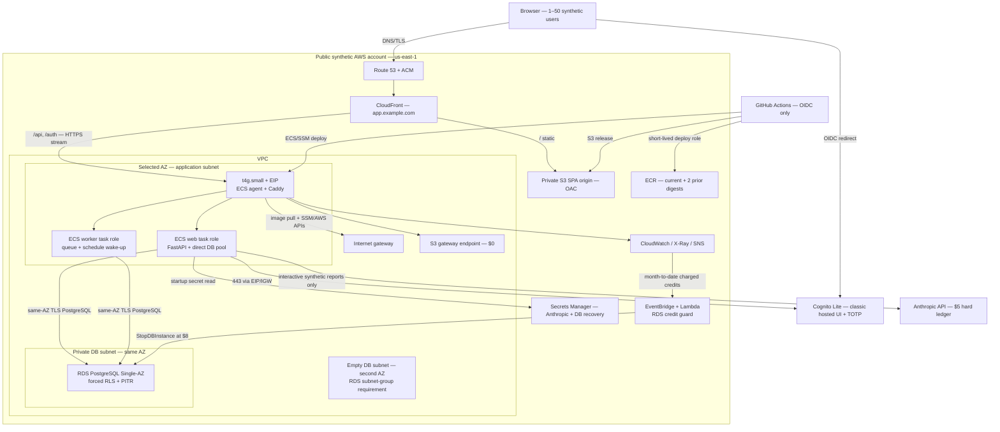
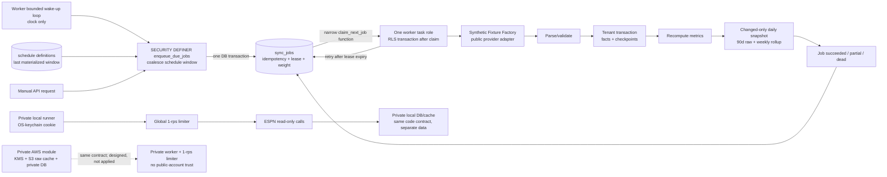
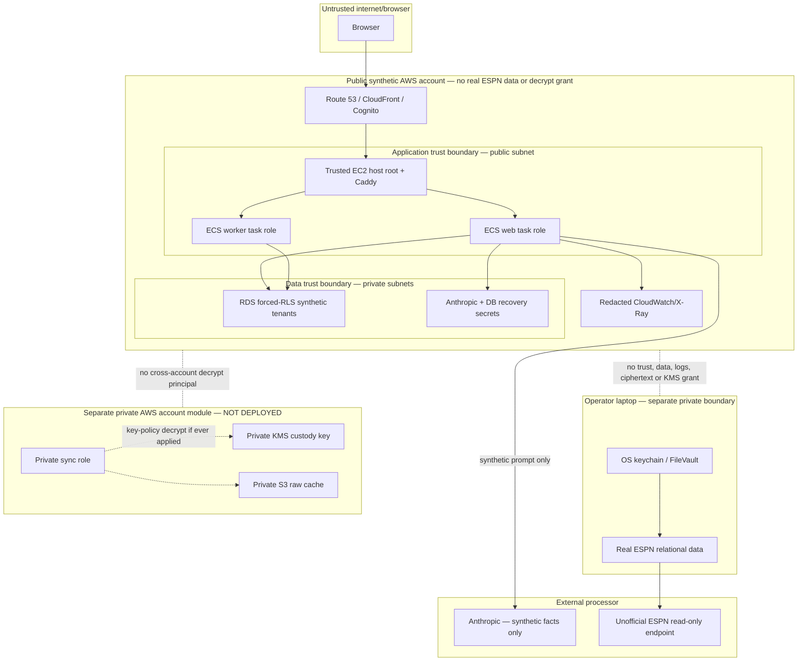

# Sprint 9, Stage 3 — public-first AWS architecture

Status: architecture decision complete; implementation and migration are not authorized by this
stage. Prices were verified on 2026-08-09 against the official service pages linked in the ADRs,
use `us-east-1`, 730 hours/month and exclude introductory/12-month offers and the temporary T4g
trial. The base table excludes unobserved RDS surplus credits; amendment C2 adds their reserve and
fail-closed cost guard. Perpetual published free allowances are included and monitored.

## Outcome

Deploy a **public synthetic-only stack** for approximately **$34.26 AWS + a hard-capped $5 Anthropic
per month = $39.26 all-in**. It uses one public-egress `t4g.small`, Single-AZ RDS PostgreSQL, a
one-node ECS-on-EC2 web/worker deployment, PostgreSQL job queue, Cognito Lite, and an S3/CloudFront
single origin. It has no NAT gateway, ALB,
interface endpoint, RDS Proxy, SQS, EventBridge Scheduler, Aurora, stranger ESPN credential or raw
ESPN payload.

The optional private AWS stack prices at approximately **+$33.80 AWS/month**, so the combined design
would still be about **$68.06 AWS + $5 Anthropic = $73.06**, below the ceiling. It nevertheless does
**not earn deployment**: it duplicates operations while retaining the provider-contract/custody
risk, and it does not strengthen the hosted artifact's tenant-isolation evidence. Its KMS key,
private worker role, S3 raw cache and 03:00 cloud schedule remain documented/unapplied Terraform.
Private real-data mode stays local. This is a judgment call based on purpose and risk, not a claim
that cost made it impossible.

This is a 99.0%-target portfolio system with a five-minute relational RPO and operator restore. The
single host/AZ is an accepted failure domain. Blue/green containers later make a **cutover**
reversible; they do not create an SLA or survive host failure.

## Decision order and ADR index

Networking is first because it determines which compute shapes are economically coherent.

| Order | Decision | Selected outcome | Monthly selected delta | Accepted failure |
| ---: | --- | --- | ---: | --- |
| 1 | [ADR-001 networking](adr/001-networking.md) | Public-egress app subnet, private RDS, one EIP, no NAT/endpoints | **$3.65** | Public address/broad outbound 443; one AZ. |
| 2 | [ADR-002 compute](adr/002-compute.md) | One On-Demand arm64 ECS-on-EC2 `t4g.small`, 20-GiB gp3 | **$13.86** before address | Web/worker have task roles but share one patched host/kernel and CPU credits. |
| 3 | [ADR-003 data](adr/003-relational-data.md) | Single-AZ `db.t4g.micro`, 20-GiB gp3, no Proxy | **$13.98** | Operator restore; 1-GiB burstable database. |
| 4 | [ADR-004 async](adr/004-async-jobs.md) | PostgreSQL leases + durable DB schedule/wake-up loop | **$0** | Queue stops with DB/host; team owns lease/definer SQL. |
| 5 | [ADR-005 identity/session](adr/005-identity-and-session.md) | Cognito Lite classic UI + opaque DB session | **≤$0.01** | Login/pool loss; manual re-enrollment. |
| 6 | [ADR-006 secrets/keys](adr/006-secrets-and-keys.md) | Two Secrets Manager secrets; no public CMK | **≤$0.81** | Cold start/AI depends on Secrets Manager. |
| 7 | [ADR-007 raw cache](adr/007-raw-cache.md) | None publicly; local files or S3 only for private mode | **$0 public** | One-day/local replay loss. |
| 8 | [ADR-008 frontend/edge](adr/008-frontend-and-edge.md) | S3 + CloudFront PAYG + Route 53, single browser origin | **$1.68** incl. new-domain allowance | Edge errors can cache/route incorrectly; backend still one host. |
| 9 | [ADR-009 observability](adr/009-observability.md) | Bounded CloudWatch/X-Ray with OTel | **$0 expected** | Sampling and 14-day logs limit retrospection. |
| 10 | [ADR-010 IaC](adr/010-infrastructure-as-code.md) | Terraform + versioned S3 state | **$0.01** | State/provider/solo-approval risk. |
| 11 | [ADR-011 CI/CD](adr/011-ci-cd.md) | Existing GitHub Actions + OIDC/ECR/SSM | **$0.20 AWS** | GitHub blocks deploy; single-host blue/green is not HA. |

## Public-only topology

### System architecture



The application security group has no SSH/HTTP ingress. TCP/443 accepts CloudFront origin-facing
addresses; Caddy additionally validates Host and an origin header. RDS has no public route/address
and accepts only the application security group. The one public IP exists for stable HTTPS origin
and outbound APIs—it is not evidence that the database or arbitrary ports are public.

### Request path

```mermaid
sequenceDiagram
    participant B as Browser
    participant C as CloudFront
    participant S as Private S3
    participant A as Caddy/FastAPI
    participant I as Cognito Lite
    participant D as RDS PostgreSQL

    B->>C: GET /
    C->>S: OAC fetch index/assets
    S-->>C: hashed assets + no-cache index
    C-->>B: SPA + security headers
    B->>C: GET /auth/login
    C->>A: same-origin login route
    A-->>B: PKCE/state redirect
    B->>I: classic hosted UI + TOTP
    I-->>B: authorization code to /auth/callback
    B->>C: callback
    C->>A: callback + state cookie
    A->>I: token exchange / validation over TLS
    A->>D: create hashed opaque session
    A-->>B: __Host-session + CSRF token
    B->>C: GET /api/tenants/T1/portfolio
    C->>A: uncached request + session
    A->>D: BEGIN; validate session/membership
    A->>D: SET LOCAL app.user_id, app.tenant_id
    A->>D: set-based reads under FORCE RLS
    D-->>A: tenant-scoped rows
    A->>D: COMMIT
    A-->>C: streamed JSON / bounded response
    C-->>B: no-store authenticated response
```

A guessed tenant/object ID never becomes authority. Membership is checked before tenant context;
the runtime role cannot bypass RLS; a cross-tenant lookup returns 404. CloudFront caches no API/auth
response and never includes application cookies in the S3 cache key.

### Sync and job data flow



Public jobs exercise tenant fairness, leases, replay and poison behavior without calling ESPN. Local
private sync groups 115 leagues by five credential bundles, enforces one global request start/second
and stores compressed cache files for ≤24h outside SQLite. Increasing workers never increases the
provider rate. The public stack also disables live FFC/nflverse imports and generates the required
reference/opportunity shapes; no real athlete/member/league corpus is needed to prove the design.

### Trust and security boundaries



The dashed separation is the primary custody control. A mode flag is not. Public administrators can
inspect synthetic tenants, and the migration role can bypass RLS by design; no public principal can
turn that privilege into access to operator cookies because the assets/key do not exist there.

## Detailed behavior and operational contracts

### Data and connection path

The web process and DB share one AZ. The release gate removes the 697–929-query N+1 and proves ≤25
SELECTs on the four profiled reads with the real forced-RLS role. Pooling is direct; RDS Proxy is
rejected at about $21.90/month plus an extra hop. If the selected topology cannot meet the 750-ms
warm p95 after query removal, diagnose connection wait, DB execution, serialization and RLS plan
separately before resizing.

The 20-GiB RDS minimum is not justified by today's 14.5 MB alone; it is the service allocation. The
90-day/weekly history policy bounds the compounding snapshot term. Backups cover the entire cache-
free relational closure and exclude fixture/raw objects. Quarterly drills restore a new DB, validate
RLS/constraints/canaries and serve smoke reads before deletion.

### Frontend, session and configuration

`VITE_API_BASE` is removed from the deployment contract. The same built bundle uses relative
`/api`/`/auth`; non-secret `config.json` is runtime data. A CloudFront behavior split supplies one
browser origin and avoids CORS. Hashed assets are immutable; entry documents are no-cache. API
responses, session cookies and CSRF headers never enter static cache behavior.

The Cognito access-token exchange creates an opaque one-hour-or-shorter application session and then
discards provider tokens. Ordinary API calls validate that server-side session, not a Cognito bearer
from JavaScript. PostgreSQL is authoritative for roles; Cognito is authoritative for
authentication. Daily identity inventory plus manual re-linking handles pool/DB divergence, but full
user recovery can take two business days—an explicit exception to the infrastructure RTO.

An SSM State Manager association on the trusted host runs the daily Cognito inventory exporter with
an instance-profile permission limited to `ListUsers`/pool description and one operations-S3 prefix.
It has no application-secret or database permission. A missed inventory is an alarm and retries on
the next association; it is not represented as a credential backup.

### Deployment and cutover capability

GitHub Actions uses OIDC, builds an arm64 digest, runs synthetic/PostgreSQL/RLS gates and publishes
ECR/S3 artifacts. A protected manual deployment runs Alembic once as a one-off ECS task under
advisory lock, starts the inactive ECS web slot, checks readiness and tenant canaries, then switches
Caddy and the SPA index.
The prior slot/assets remain until verification. This supports reversible cutover on one host; it
does not protect against that host failing. Stage 4 owns exact rollback triggers and time boxes.

## Public-only monthly cost

Cost assumptions: ≤50 direct Cognito MAU; ≤100 SES recipients; ≤10M CloudFront requests/1 TB transfer;
≤100 GB aggregate regional egress; ≤5 GB logs, 10 custom metrics, 10 alarms and 100k traces; two
private ECR image GiB; one 20-GiB EC2 volume; one 20-GiB RDS volume; no credits; Anthropic authorized
spend capped at exactly $5. These are budget guardrails, not observed cloud usage.

| Component | Quantity / unit rate | $/month | Why / guardrail |
| --- | --- | ---: | --- |
| EC2 `t4g.small` On-Demand | `$0.0168 × 730` | **$12.26** | >$10: one 2-GiB persistent host covers Caddy/web/worker and streaming memory floor. |
| EC2 gp3 | `20 GiB × $0.08` | **$1.60** | Images/temp/rollback headroom; 3,000 IOPS included. |
| ECS EC2 launch type / task roles | one cluster, web + worker services | **$0.00** | Separates task IAM without buying Fargate; common host remains trusted. |
| Public IPv4 / EIP | `$0.005 × 730` | **$3.65** | Replaces $36.50 NAT; stable TLS origin/egress. |
| NAT gateways | none | **$0.00** | Explicitly disabled. |
| Interface VPC endpoints | S3 gateway only | **$0.00** | Gateway endpoint has no charge; no interface endpoints. |
| Internet gateway / ≤100 GB regional egress | one / below aggregate allowance | **$0.00** | Monitor; not an unlimited promise. |
| RDS PostgreSQL `db.t4g.micro` | `$0.016 × 730` | **$11.68** | >$10: managed PostgreSQL/RLS/PITR/patching replaces self-operated DB. |
| RDS gp3 | `20 GiB × $0.115` | **$2.30** | Covers static 100× projection and retained-history headroom. |
| RDS automated backup/PITR | 14d, total backup below provisioned storage | **$0.00** | Cache excluded; monitor actual backup bytes. |
| Quarterly restore drill | 4 DB-hours/quarter amortized | **$0.03** | A backup without a restore test is not accepted. |
| RDS Proxy / ALB | none | **$0.00** | Avoids $21.90 proxy and $16.43 ALB floors. |
| PostgreSQL job queue/worker clock | existing DB/worker | **$0.00** | Durable schedule is in DB; SQS/EventBridge/Step Functions not deployed. |
| Cognito Lite | ≤50 direct MAU | **$0.00** | TOTP + classic hosted UI within 10k-MAU free tier. |
| SES verification/recovery email | ≤100 recipients at $0.10/1k | **$0.01** | No SMS/dedicated IP/plan. |
| Secrets Manager | 2 secrets + ≤2k calls | **$0.81** | Anthropic and RDS recovery; runtime DB uses IAM auth. |
| Customer-managed KMS keys | none publicly | **$0.00** | AWS-managed encryption is sufficient for synthetic data. |
| S3 SPA storage/requests | <1 GiB and bounded origin reads | **$0.01** | Private OAC bucket; raw cache absent. |
| CloudFront PAYG | below perpetual allowance | **$0.00** | API uncached, static cached; alerts before allowance. |
| Route 53 zone + queries | one zone + mostly free alias queries | **$0.51** | Includes $0.01 allowance for origin DNS queries. |
| Domain registration allowance | assumed `.com` `$14/year` | **$1.17** | $0 if an existing domain is reused. |
| ACM / origin certificate | AWS ACM + Let's Encrypt DNS-01 | **$0.00** | TLS viewer and origin. |
| CloudWatch/X-Ray/SNS/Budgets | within R18 caps | **$0.00** | No paid APM/Application Signals/high-cardinality metrics. |
| ECR private images | ≤2 GiB at $0.10/GiB-month | **$0.20** | Current + two prior digests with lifecycle. |
| SSM Run Command/Session Manager | one EC2 node | **$0.00** | No SSH/bastion. |
| Terraform/operations S3 | state lock/versions + identity/CloudTrail inventory | **$0.03** | Terraform software and management-event trail are $0. |
| GitHub OIDC / AWS deploy operations | existing GitHub plan | **$0.00 AWS** | Incremental GitHub minutes remain measured-after-build, not invented. |
| Anthropic API | hard UTC-month ledger | **$5.00 external** | Cached-only at trip; no scheduled/private AI. |
| AWS Basic Support | included | **$0.00** | No paid support plan. |
| **Public subtotal** |  | **$34.26 AWS + $5.00 external = $39.26** | **$110.74 below the $150 ceiling.** |

The two items above $10 are justified in their ADRs. They are the minimum persistent compute and
managed PostgreSQL allocations that satisfy measured memory, warm pools, RLS, PITR and restore. No
line relies on the first-year RDS/API Gateway offer or the T4g promotional trial.

## Optional separate private AWS stack — priced, not selected

This is a full separate-account delta, not shared public infrastructure. It has no Anthropic key or
real-data telemetry link. A parent DNS delegation is the only administrative relationship.

| Private component | $/month delta |
| --- | ---: |
| EC2 `t4g.small` + 20-GiB gp3 + one IPv4 | $17.51 |
| RDS `db.t4g.micro` + 20-GiB gp3 + restore drill | $14.01 |
| Cognito Lite + ≤100 SES recipients | $0.01 |
| Private DB recovery secret/calls | $0.41 |
| Customer-managed KMS custody key/requests | $1.00 |
| S3 raw cache with 24h lifecycle | $0.11 |
| CloudFront/S3 UI + delegated Route 53 zone/queries | $0.52 |
| ECR images | $0.20 |
| Terraform/identity/CloudTrail S3 | $0.03 |
| CloudWatch/X-Ray/SSM/S3 endpoint/NAT/ALB | $0.00 |
| **Optional private AWS delta** | **$33.80 AWS** |

Combined with public: **$68.06 AWS + $5 Anthropic = $73.06/month**. The budget permits it, but the
portfolio purpose does not justify deploying a second real-data control plane. If future evidence
changes that judgment, its account/key policy, data migration and provider-risk review are separate
gates; “there is room in the budget” is not approval.

Local private mode instead uses the current machine, PostgreSQL-or-SQLite-compatible local path
during migration, OS keychain/FileVault and a compressed ≤1-GiB/24h cache directory. Incremental AWS
cost is $0 and unattended cloud 03:00 sync is intentionally forfeited.

## Three most likely budget blow-ups

1. **Turning on topology defaults:** one NAT adds $36.50; two add $73; five interface endpoints add
   $36.50/AZ; an ALB adds $16.43 before LCU. Terraform defaults and budget alarms keep all off.
2. **Applying the private root or HA by accident:** private adds $33.80; Multi-AZ RDS adds about
   $13.98; Fargate+ALB can replace $17.51 compute with about $59.77. Separate apply roles and plans
   make those visible decisions.
3. **Unbounded usage/cardinality:** high-cardinality metrics/log bodies, uncached asset churn,
   export egress or bypassing the AI ledger can turn $0/$5 lines variable. Hard AI authorization,
   log/metric caps, CloudFront alarms, no raw bodies and streamed exports are budget controls.

The most likely legitimate resize is `t4g.small → t4g.medium` after Linux concurrency measurement,
about +$12.26/month. It remains within the ceiling but must update the bill before deployment.

## What changes at 100× scale and at one-tenth the budget

These are triggers, not features to prebuild.

| Major decision | Selected portfolio scale | At 100× workload/tenants | At 1/10 budget (~$10–15 AWS) |
| --- | --- | --- | --- |
| Networking | One EIP, public-egress host, same-AZ DB, no NAT/ALB | Multi-AZ private tasks behind ALB; controlled NAT/egress proxy and selected endpoints. Pay the duplicated fault domains and enforce egress centrally. | One Lightsail/IPv6 VM or local-only demo; accept public 443 and no managed private network. |
| Compute | One 2-GiB EC2 host with cgroup-separated web/worker | Separate autoscaled ECS/Fargate web and worker services; precompute CPU paths; capacity/load tests and at least two AZs. | $12 Lightsail bundle, or Lambda only after exports/jobs are redesigned; pause non-demo hours. |
| PostgreSQL | Single-AZ RDS micro, direct pool, forced RLS | Multi-AZ RDS/Aurora, larger instance, read strategy, connection proxy only after benchmark, partition retained snapshots when measured. | Neon Free/local PostgreSQL or DB on the VM; explicitly weaken 14-day PITR/RTO rather than claim equivalence. |
| Async/fairness | PostgreSQL leases + DB schedule/wake-up loop | EventBridge Scheduler → SQS fair queues/DLQ → independently scaled workers; distributed global limiter and per-tenant quotas; outbox earns its complexity. | Keep DB queue, run jobs manually/on access, or omit unattended public fixture refresh; never use an in-memory queue while claiming durability. |
| Custody/deployment | Public synthetic AWS; private real data local; private AWS unselected | Real strangers only after written provider authorization, dedicated security/on-call ownership and per-environment account/key/data cells. Otherwise remain synthetic regardless of scale. | Static synthetic demo plus architecture/tests; keep all real data local and remove KMS/S3/private modules from applied state. |

The 100× answer is not “make every box bigger.” It changes fault domains, coordination and operating
ownership. The 1/10 answer explicitly gives up managed recovery/always-on behavior; it cannot retain
the same RPO/RTO merely by choosing cheaper logos.

## What a staff engineer would ask about this

1. **“Why expose an EC2 public IP to save $32.85?”** The address is an egress/origin mechanism, not
   broad ingress: SG permits only CloudFront-origin TLS, Caddy validates Host/origin header, RDS is
   private, there is no SSH, and app destinations are fixed. The accepted risk is public-kernel and
   broad outbound-443 exposure. NAT would not filter hostnames or fix application SSRF by itself; it
   would primarily hide the source address for $36.50/month.
2. **“Is a PostgreSQL queue just avoiding SQS because the diagram is small?”** At one worker, jobs
   and results require the same DB. A leased row makes acceptance atomic and removes the outbox/send
   split while preserving at-least-once, idempotency, poison, fairness and backpressure. Narrow
   definer functions solve cross-tenant claim/schedule discovery without giving the worker
   `BYPASSRLS`. SQS becomes
   better when workers/availability scale independently or work must survive DB outage; those are
   explicit revisit triggers and the adapter seam is retained.
3. **“Why not deploy private AWS when the combined $73.06 fits?”** Budget is necessary, not
   sufficient. It duplicates a control plane to run unsupported real-data automation, adds custody
   and ops risk, and contributes less interview evidence than RLS attacks, migrations and restore
   drills already present publicly. The design and cost prove it is possible; withholding apply
   proves the risk decision is intentional.

**Whiteboard cold for a senior interview:** NAT versus PrivateLink versus public egress total cost;
security groups versus actual trust boundaries; same-AZ latency versus Multi-AZ availability; direct
pool versus Proxy; RDS/Aurora/serverless cost floors; PostgreSQL leasing versus SQS at-least-once and
outbox failure windows; single-origin cookie/CORS/CDN behavior; RPO versus RTO versus cutover; account
and KMS key-policy boundaries; 100× trigger-based evolution.

**Implementation detail to look up:** exact Terraform resources/provider arguments, CloudFront cache/
origin-request policy IDs, managed prefix-list weight/quota, Caddy DNS plugin configuration, Cognito
app-client flags, IAM DB token library hooks, ECS task-definition/Caddy service syntax, `SKIP LOCKED` query syntax, OTel
exporter settings and current service SKU identifiers.

## Amendments — operational prerequisites for migration

These amendments do not change the public request/data topology. They add one external cost-guard
control, correct three ways the original fixed-cost/health story could have failed silently and add
the cutover memory multiplier. The
details and current source links are in [ADR-002](adr/002-compute.md),
[ADR-003](adr/003-relational-data.md), [ADR-008](adr/008-frontend-and-edge.md) and
[ADR-009](adr/009-observability.md).

### C1. Silence is now an alarm condition

The criticism is correct: a worker cannot be the only witness to its own death. All continuously
self-published gauges emit healthy zero/one values every five minutes from a telemetry loop separate
from job claiming; their alarms use `treat_missing_data = "breaching"` and 3-of-4 periods. Daily
certificate/restore gauges use 2-of-3 days. The external witnesses are AWS EC2 status metrics, RDS
connection/credit metrics and AWS service events for EC2, ECS and RDS.

The resulting order of evidence is explicit:

| Failure | First signal | Confirming signal | Detection gap left |
| --- | --- | --- | --- |
| Host stop/system failure | EC2 state-change/status check | Missing worker gauges at ~15m; RDS connections <1 | Human response remains unbounded; detection is not. |
| Container crash loop | ECS task-`STOPPED` event | Missing worker heartbeat at ~15m, or API 503 for web | A crash between event delivery failures could wait for the absence alarm. |
| Database unreachable | RDS event or AWS `DatabaseConnections` low/missing | Request health plus queue/sync gauge breach/missing | A brief event below the evaluation window is intentionally tolerated. |
| Claim loop deadlock on healthy host | Eligible-job age >2h while heartbeat remains 1 | Due/success gap or oldest clean success >26h | Two hours is the accepted stall-detection latency. |

The old eight-alarm set did **not** prove that a live worker was claiming jobs. The replacement
separates liveness from progress: an increasing eligible-job age catches a healthy publisher that
claims nothing; due-versus-clean-success catches a scheduler that created no job. No job due means
no queue alarm, correctly. The public account retains ten low-cardinality custom series and nine
alarm families; up to **$0.50/month** is reserved if metric-math inputs exceed the ten free alarm
metrics.

**Migration consequence:** these alarms and service-event routes are a Stage 4 prerequisite. The
runbook may not switch traffic while a required alarm is `ALARM` or `INSUFFICIENT_DATA`, and fault
injection must prove the four rows above before rollback triggers can be trusted.

### C2. Burstable credits are two different cost decisions

The amendment's Standard/Unlimited choice applies to EC2, not RDS:

| Resource | Verified behavior | Decision | Cost/failure accepted |
| --- | --- | --- | --- |
| EC2 `t4g.small` | T4g defaults to Unlimited but supports Standard; surplus is $0.04/vCPU-hour. | Pin `CpuCredits=standard` in the launch template. Alarm on low `CPUCreditBalance` plus above-baseline CPU and pause CPU-heavy jobs. | Fixed $12.26 compute; latency/throttling after depletion. |
| RDS `db.t4g.micro` | RDS T4g PostgreSQL is forced Unlimited; surplus is $0.075/vCPU-hour. | Monitor balance/surplus/charge; review at $5 projected. A five-minute non-VPC Lambda stops this DB at 6,400 month-to-date charged credits = $8 and re-stops a seven-day auto-restart. | Variable line. Expected $0 surplus; $12 worst-settlement reserve; availability fails closed for budget. |

The correction is important: AWS publishes the EC2 `t4g.micro` 10% baseline, but the cited RDS
pages do not publish a separate `db.t4g.micro` earn-rate table. Importing that number would produce
a reassuring but unverified $100.44 “bound.” The baseline-independent full-month maximum is
`2 × 744 × $0.075 = $111.60`, which can put the old all-in table over $150. The $8 automatic stop
is therefore the actual ceiling control. Allowing a conservative full 24-hour settlement after the
last poll gives `$8 + $3.60 = $11.60`, rounded to a **$12 reserve**; public all-in operating envelope
is `$39.26 + $12 + $0.50 = $51.76`. The Lambda's ~8,640 monthly checks are $0 within the published
free allowance. Applying the private stack would duplicate variable exposure and is not approved by
the old $73.06 expected-cost comparison alone.

| C2 cost amendment | Expected $/month | Reserved ceiling | Basis |
| --- | ---: | ---: | --- |
| EventBridge + Lambda RDS credit guard | **$0.00** | **$0.00** | ~8,640 short invocations, below published free allowances. |
| RDS surplus credits | **$0.00 unmeasured** | **$12.00** | $8 trip plus conservative $3.60 delayed full-day settlement, rounded up. |
| CloudWatch alarm-metric overage | **$0.00** | **$0.50** | Metric math may exceed ten free alarm metrics. |
| **Public all-in** | **$39.26** | **$51.76 operating envelope** | Still $98.24 below the $150 ceiling. |

Credit exhaustion/charges replace generic “unbounded use” in the three most likely budget risks:

1. topology defaults (NAT/endpoints/ALB);
2. accidentally applying private/HA infrastructure; and
3. forced-Unlimited RDS credits or a compute resize caused by the nightly burst.

High-cardinality telemetry, egress and bypassed AI authorization remain guarded risks, but the CPU
credit line is more directly coupled to this measured workload.

### C3. Origin-certificate failure is observable and fails closed

A daily SSM check publishes the days remaining on the certificate actually served by Caddy. The
alarm threshold is 21 days and missing daily samples breach. The tested manual path checks served
`notAfter`, Caddy/ACME logs, clock and DNS; assumes a short-lived break-glass role; forces graceful
reprovision/reload; verifies externally; and revokes the session. A secondary ACME issuer is
configured for a Let's Encrypt outage/rate limit.

The internet-facing host's DNS-01 permission is restricted by hosted-zone resource and Route 53
conditions to `UPSERT`/`DELETE`, TXT, and exactly the normalized
`_acme-challenge.origin.app.example.com` record. It cannot change application/A/alias/NS records.
If origin TLS or the host fails, S3/CloudFront may still serve the cached SPA shell; `/api` and
`/auth` return a short-lived, tenant-data-free 503 and never stale authenticated data. That is
graceful degradation, not availability of the application.

### C4. Cutover capacity includes both slots

The Linux release measurement now runs the ECS agent, Caddy, worker, active web under the heaviest
read/export and candidate web through readiness/canary concurrently, then requires 25% memory
headroom. If that cutover shape does not fit 2 GiB, choose one honestly:

- resize to `t4g.medium` and add **$12.26/month** before cutover; or
- drain new requests for at most two minutes, replace the old slot, accept brief unavailability and
  call it a staged drain/replace—not blue/green or zero downtime.

Two simultaneous full exports across both slots are not admitted during the swap. Steady-state
memory alone is no longer sufficient evidence for the selected compute.

## What a staff engineer would ask about the amendments

1. **“Won't missing-is-breaching alert on every deploy?”** Fast gauges require 3 of 4 five-minute
   breaches, while the expected restart is under ten minutes. More importantly, deploy is not a
   blind alarm mute: if publication does not recover, the ~15-minute signal is correct and blocks
   cutover. Daily certificate/restore gauges have their own 2-of-3-day window.
2. **“Is stopping RDS at $8 over-engineering a $39 demo?”** It is a small, $0-expected service-plane
   guard demanded by a hard ceiling against a forced-Unlimited SKU. The honest trade is severe:
   availability is sacrificed when it trips. Without it, the baseline-independent credit maximum
   can push the total over $150 and AWS Budgets is not a real-time cap.
3. **“Can the worker still be silently stuck while all infrastructure alarms are green?”** Yes if
   only liveness is measured; no under the amended progress contract. A live publisher with an
   unclaimed eligible row trips at two hours, while failure to materialize work trips the independent
   due/success or 26-hour staleness signal. The accepted weakness is that two-hour detection latency.

**GATE: Stage 3 amendments complete. Proceed to Stage 4 migration strategy only.**
