# Sprint 9, Stage 6 — risk-sequenced delivery phases

Status: design complete; this file authorizes no production code, live provider call, AWS apply,
data deletion or model spend

## Outcome

Deliver the public synthetic multi-tenant artifact through **16 contract phases, 30–45**, ordered by
current loss exposure and unknown feasibility rather than UI or infrastructure convenience.

Premise correction: this is not a two-week Scrum sprint. It is a solo migration program represented
in the repository's existing phase-contract convention. The estimate is **83 build sessions** plus
**1,990 operator review minutes (33.2 hours, or 22.1 additional 90-minute session-equivalents)**.
That is about **105 focused session-equivalents** before unplanned debugging. No calendar duration is
claimed because weekly operator availability was not supplied.

One working session means 90 focused minutes with one bounded objective and preserved evidence.
Agent wait time does not magically become human capacity: contract acceptance, handoff verification,
finding adjudication and merge use the separate Stage 5 E1 budget.

No phase begins until its `docs/phase-N-name.md` is reviewed by an independent assigned specialist
and accepted by the operator at an immutable contract SHA. Agent 1 drafts/orchestrates; the phase
owner writes only after acceptance; QA/security/AWS/UI review assignments follow the current Stage
5 six-role matrix. Every phase uses offline CI by default and an E-numbered evidence ledger. The
explicitly named live/AWS exercises are manual, bounded exceptions and never ordinary CI.

## Numbering reconciliation and launch gates

Earlier stages called `hosted-data-safety` Phase 30 and `private-recovery-baseline` Phase 31, while
also saying Stage 6 would finalize numbering. That document order is the wrong risk order.

- **Phase 30 is now `private-recovery-baseline`.** There is currently no recovery point for the only
  irreplaceable data. It precedes every schema or retention mutation.
- **Phase 31 is now `hosted-data-safety`.** It establishes synthetic provenance, deployment-mode
  fail-closed behavior and the AI spend ledger before any hosted CI or public generation.

This swap supersedes the provisional numbers in Stages 1 and 4; the names and ownership survive.
**Both Phase 30 and Phase 31 are hard public-launch prerequisites.** Phase 30 also gates destructive
private migration/cleanup. Phase 31 gates hosted CI artifacts, AWS seed, and AI generation. Neither
can be waived because later infrastructure is “only synthetic.”

## Risk and dependency order

```mermaid
flowchart LR
    p30["30 Private recovery"] --> p31["31 Hosted-data safety"]
    p31 --> p32["32 Live provider spike"]
    p32 --> p33["33 Query-budget spike"]
    p33 --> p34["34 Linux cutover-capacity spike"]
    p34 --> gate{"Feasibility gate"}
    gate --> p35["35 PostgreSQL/Alembic parity"]
    p35 --> p36["36 Tenant isolation kernel"]
    p36 --> p37["37 Tenant API retrofit"]
    p37 --> p38["38 Query/export productionization"]
    p38 --> p39["39 Durable work orchestration"]
    p39 --> p40["40 Identity/session/frontend"]
    p40 --> p41["41 Observability/retention"]
    p41 --> p42["42 Public IaC/CI"]
    p42 --> p43["43 Migration/recovery rehearsal"]
    p43 --> p44["44 Public synthetic launch"]
    p44 --> p45["45 Rollback-window contract"]
```

The feasibility gate exists because three inputs are currently unknown:

1. **Live ESPN latency/error behavior:** Phase 32 instruments the real private path and observes a
   bounded cold sync plus ordinary sync windows. It does not infer network performance from the
   0.013-ms fixture replay.
2. **Whether ≤25 SELECTs is achievable:** Phase 33 proves or rejects the budget on all four profiled
   reads with forced RLS before the 122-call-site retrofit.
3. **Linux steady/cutover memory:** Phase 34 runs the actual arm64 Linux/cgroup task shape, including
   both slots and one export, before Terraform commits to `t4g.small` or blue/green wording.

If one fails, revise the requirement/ADR and repeat the contract gate. Do not proceed on the theory
that implementation will somehow make the number work later.

## Program summary

Costs reuse Stage 3's verified rates; this plan does not silently re-price them. “$0” below means no
new recurring AWS resource is applied by that phase, not zero operator or subscription cost.

| Phase | Contract | Build sessions | Operator minutes | New AWS/external cost | Exit/gate |
| ---: | --- | ---: | ---: | --- | --- |
| 30 | `private-recovery-baseline` | 3 | 105 | $0 AWS/month; separate physical volume is a one-time actual purchase | Off-device restore passes; gates all later mutation and launch. |
| 31 | `hosted-data-safety` | 7 | 130 | $0 AWS/month; existing model subscriptions only | Synthetic provenance and $5 ledger pass; gates hosted CI/seed/AI/launch. |
| 32 | `provider-behavior-spike` | 2 | 70 | $0 AWS/model spend; bounded existing ESPN reads only | Live latency/bytes/cache/status evidence or explicit unmeasured method. |
| 33 | `query-budget-feasibility` | 3 | 100 | $0; disposable local PostgreSQL | Four equivalent reads ≤25 SELECTs under forced RLS, or stop/revise. |
| 34 | `linux-cutover-capacity` | 3 | 95 | **≤$0.25 one-time cap** for ≤6h disposable `t4g.small`; actual billed cost recorded | Select 2-GiB dual-slot, resize, or staged drain before implementation. |
| 35 | `postgres-alembic-parity` | 6 | 135 | $0 recurring before apply | Empty/upgrade/import PostgreSQL paths and all dialect hazards pass. |
| 36 | `tenant-isolation-kernel` | 8 | 160 | $0 recurring | Forced RLS/composite FK/context attacks pass as runtime roles. |
| 37 | `tenant-api-retrofit` | 7 | 155 | $0 recurring | All 122 sensitive sites and 50 routes dispositioned; no takeover. |
| 38 | `query-export-productionization` | 5 | 110 | $0 recurring | Four reads hit query/latency budgets; export ≤256 MiB. |
| 39 | `durable-work-orchestration` | 7 | 135 | $0 recurring on selected DB/host | Queue, fairness, retries, poison/backpressure and retention pass offline. |
| 40 | `identity-session-frontend` | 6 | 135 | $0 before apply; Cognito/SES selected expected $0/$0.01 after launch | Authn/authz/session/edge contracts pass; identity-loss recovery documented. |
| 41 | `observability-retention` | 5 | 110 | $0 before apply; ≤$0.50 alarm reserve after launch | Silence, deadlock, DB and host failures all signal externally. |
| 42 | `public-infrastructure-ci` | 8 | 160 | $0 plan-only; Terraform/state software line remains $0/$0.01 after apply | Reviewed no-NAT public-only plan and full PR/release gates. |
| 43 | `migration-recovery-rehearsal` | 6 | 145 | **≤$25 one-time rehearsal cap**; actual Cost Explorer value recorded | Timed T-7 rehearsal, restore, alarms, credits and N−1 proof pass. |
| 44 | `public-synthetic-launch` | 4 | 165 | Stage 3: $34.26 AWS + ≤$5 external AI = $39.26 expected; $51.76 operating envelope | Runbook passes and 30-minute observation closes. |
| 45 | `rollback-window-contract` | 3 | 80 | Same operating envelope; no new service | Rollback window/evidence/actual-cost review closes; only proven contractions. |
| **Total** |  | **83 sessions** | **1,990 min** | Public ceiling remains **$51.76 envelope**, far below $150 | Launch follows 14 prior gates, not agent confidence. |

The Phase 34 and 43 amounts are authorization caps, not expected forecasts. Their ledgers record the
actual billed value. If an experiment cannot be bounded by its cap, it does not start.

## Phase contracts

### Phase 30 — `private-recovery-baseline` (3 sessions; 105 operator minutes)

**Outcome:** create the encrypted, cache/credential-free, off-device recovery point and prove one
scratch restore before anything mutates the only irreplaceable state.

**Change surface:** backup/export script, manifest/canary, encrypted repository integration, local
backup-age state/UI and restore verifier. It protects AI reports, metric snapshots, import
diagnostics, FFC snapshot and non-secret account configuration.

**Explicit guarantees:** no database schema or analytics semantics change; no ESPN/Anthropic/network
call; no raw cache, SWID, `espn_s2`, Fernet/keychain material or report content enters logs; no
public/cloud upload. Existing local reads remain available when the write gate trips.

**Acceptance/offline evidence:** consistent source backup; excluded-field fail-closed manifest;
hourly/change and post-clean-sync scheduling; 24-hour stale protected-write gate; encrypted
off-device artifact; scratch restore with canary, adjusted counts/hashes, integrity/FK/unique/four
partial-index-shape checks and the four profiled reads. Record actual artifact bytes, duration and
operator minutes. No phase closes with a restore from the source laptop copy.

### Phase 31 — `hosted-data-safety` (7 sessions; 130 operator minutes)

**Outcome:** make it structurally impossible for public hosted/CI mode to ingest real ESPN data or
authorize unbounded AI spend.

**Change surface:** Synthetic Fixture Factory for every used provider view and malformed variants;
allowlist/grammar scanner and provenance manifest; explicit `public_synthetic` versus
`private_operator` configuration; hosted provider/cookie/cache kill switches; LLM result type with
authoritative usage; UTC-month reserve/settle/unknown-spent ledger and cached-only trip UI. Introduce
the smallest reviewed Alembic baseline/additive revision needed for ledger state; Phase 35 validates
and completes PostgreSQL dialect parity.

**Explicit guarantees:** no live ESPN call; no real capture is an input to generation; recorded
`real_*.json` stays local-only and cannot enter hosted CI; no real-data AI report migrates; no public
principal gains a custody decrypt path; existing metrics/ESPN parse semantics remain unchanged.

**Acceptance/offline evidence:** deterministic seeds including 115-league/colliding-tenant shapes;
unknown fixture paths fail; every string matches a path grammar; SWID/GUID/cookie/name/league-name
adversarial tests fail the build; hosted config cannot instantiate `EspnService`; usage is persisted
for success, lost response and crashed reservation; parallel reservations cannot exceed $5; ledger
failure and ceiling make generation cached-only with no queued retry. The public launch and any
hosted AI route remain blocked until all pass.

### Phase 32 — `provider-behavior-spike` (2 sessions; 70 operator minutes)

**Outcome:** replace the unmeasured ESPN network term with bounded observations and an honest error
sample before designing worker windows/retries.

**Change surface:** feature-gated monotonic timing, status/attempt/byte/cache counters around the
single HTTP request boundary and a local evidence exporter. No provider/parser/business change.

**Explicit guarantees:** private operator only; read-only existing endpoints; global one-request-
start-per-second guard; no login/HTML/write; no cookie/header/payload logging; no extra full-
portfolio sync solely to increase sample size. All instrumentation branches have offline fakes.

**Acceptance/offline/live evidence:** offline 200/304-if-supported/401/403/404/429/5xx/timeout/
malformed-body cases prove redaction, cooldown and retry classification. With explicit operator
approval, run one cold representative-league sync bounded to the known call formula, then observe
three ordinary scheduled sync windows without adding calls. Report per-call and end-to-end p50/p95/
worst latency, statuses, retries, bytes, cache hit/miss and 429/5xx/auth counts with season/week and
sample size. If no live failure occurs, say error behavior remains unmeasured and give the additional
ordinary-window method; never report zero observed errors as a zero error rate guarantee.

**Stop condition:** if the measured request-time distribution plus `5 + completed_weeks` work cannot
fit the two-hour portfolio window at one global rps, revisit cadence/window/fairness before Phase 39.
After close, compare actual operator minutes for Phases 30–32 with E1 and reforecast the program.

### Phase 33 — `query-budget-feasibility` (3 sessions; 100 operator minutes)

**Outcome:** prove that ≤25 SELECTs is achievable on portfolio board, exposure, strategies and
opportunity charts before committing to the full tenancy retrofit.

**Change surface:** disposable PostgreSQL/RLS schema and set-based/eager read prototypes in an
isolated worktree; query-count/plan harness. The prototype is discarded by default and is not a
production refactor phase.

**Explicit guarantees:** no production schema/config/API response change; no provider/model call;
representative data is generated by Phase 31; all measurements use the non-owner forced-RLS role.

**Acceptance/offline evidence:** 115-league deterministic dataset with row counts recorded; semantic
comparison to current response fields/ordering; cold/warm plan/query counts; each path ≤25 SELECTs;
database time separated from serialization; no RLS bypass. If a path cannot meet the budget within
two bounded prototypes, stop and amend R9/compute/data ADRs—do not relax the number inside Phase 38.

### Phase 34 — `linux-cutover-capacity` (3 sessions; 95 operator minutes)

**Outcome:** choose the actual compute/cutover mode from target-Linux evidence rather than macOS RSS.

**Change surface:** disposable arm64 Linux `t4g.small` in the selected public-subnet/no-NAT shape,
synthetic-only task harness, streaming-export/query prototype, cgroup/process memory collection and
automatic teardown. No persistent stack.

**Explicit guarantees:** no real data/cookie/provider/model call; ≤6-hour lifetime and $0.25 cap;
inbound remains CloudFront-prefix/SSM-only as applicable; teardown and Cost Explorer evidence are
part of done.

**Acceptance/offline/live evidence:** measure ECS agent + Caddy + worker + active web under the
heaviest read/export, then add candidate readiness/canary and one export; record cgroup peak,
per-process RSS, CPU credits, OOM/restarts and 25% headroom. Test one and two concurrent exports but
admit only the configured limit. Exit with one recorded choice: `t4g.small` dual-slot, `t4g.medium`
at +$12.26/month, or `t4g.small` staged drain with brief unavailability. The runbook language changes
before Phase 42 if dual-slot does not fit.

### Phase 35 — `postgres-alembic-parity` (6 sessions; 135 operator minutes)

**Outcome:** make PostgreSQL and Alembic the tested schema authority without adding tenancy yet.

**Change surface:** PostgreSQL configuration/pooling/TLS; reviewed baseline and upgrades; removal of
runtime `create_all`, PRAGMA and additive ALTER; UTC `TIMESTAMPTZ`, JSONB/native booleans, BIGINT
identity, FK behavior, all named uniques and four explicit metric predicates; SQLite staging/import
transform; PostgreSQL CI service lane.

**Explicit guarantees:** no public deployment, tenant behavior, ESPN behavior, analytics formula or
API response change; private source remains read-only/reversible; no naive autogenerate acceptance.

**Acceptance/offline evidence:** empty upgrade and prior-revision upgrade; exact schema catalog;
85,125-style naive values interpreted as UTC in synthetic migration data; invalid JSON/boolean/type/
orphan cases abort; sequences advance beyond max; four NULL shapes coexist and duplicate shapes
fail; concurrent app starts perform zero DDL; compatibility manifest exists. SQLite-only tests are
retained where meaningful, but PostgreSQL is the release authority.

### Phase 36 — `tenant-isolation-kernel` (8 sessions; 160 operator minutes)

**Outcome:** establish stable tenant/user/membership identity and database-enforced isolation before
retrofitting endpoints.

**Change surface:** tenants/users/external identities/memberships; tenant discriminators; composite
parent/child FKs and uniques; `ENABLE/FORCE RLS`; non-owner app/worker roles; transaction-local tenant
context and pool reset; migration/restore privileged role; immutable league ownership and explicit
transfer contract.

**Explicit guarantees:** no route is exposed publicly until Phase 37; no Cognito dependency yet;
provider/read-model semantics unchanged; missing tenant context fails closed; owner/migration bypass
is never used by app tests.

**Acceptance/offline evidence:** named R4 attacks for absent context, guessed/colliding IDs, direct
SQL, cross-tenant composite FK, pool reuse, background job context and owner-vs-runtime role; repeat
`POST /api/leagues` returns conflict and cannot repoint; schema/tenant backfill is reversible under
expand-contract. Any isolation failure blocks all later work.

### Phase 37 — `tenant-api-retrofit` (7 sessions; 155 operator minutes)

**Outcome:** disposition the measured **122 sensitive query call sites across 19 files** and **50
unowned data-returning routes** so every read/write derives ownership from the authenticated tenant
transaction.

**Change surface:** routers, services, schemas, exports, AI inputs, opportunity/FFC paths and audit
events; centralized authorization policy; tenant-aware delete/export and transfer workflows;
machine-readable completion inventory keyed to Stage 0b symbols/tables/routes.

**Explicit guarantees:** RLS remains the safety boundary—explicit predicates aid plans/readability
but are not the only isolation control; response shapes and analytics formulas stay stable unless a
phase contract names a tenant envelope; no ESPN cadence/provider change; no frontend rollout yet.

**Acceptance/offline evidence:** every inventory item maps to code and a negative test or is proven
shared reference data; all 50 routes return 404/default-deny across colliding tenants; exports/AI/
charts cannot cross tenants; deletion/export/audit authorization passes; direct SQL attack suite
still passes under pooled runtime sessions. Zero “TODO tenant filter” exemptions.

### Phase 38 — `query-export-productionization` (5 sessions; 110 operator minutes)

**Outcome:** turn the Phase 33 feasibility result into maintainable production reads and remove the
435-MiB export floor before compute is finalized.

**Change surface:** set-based/eager portfolio and analytics readers; indexes justified by plans;
streaming JSON/CSV; write-only XLSX with bounded encrypted temporary storage; concurrency limiter;
RLS-aware query/memory regression tests.

**Explicit guarantees:** response field meaning/order and server-side analytics remain unchanged;
no provider/model/schema change except reviewed performance indexes; no RDS Proxy; exports stay
tenant-scoped and restart from the beginning on failure.

**Acceptance/offline/Linux evidence:** four reads ≤25 SELECTs and warm p95 ≤750 ms in selected
topology with database time separate; ordinary routes ≤50; JSON export first byte ≤1 second and peak
RSS ≤256 MiB; one/two-export and dual-slot measurements repeated under the final Linux container.
Failure reopens compute/cutover choice before infrastructure code.

### Phase 39 — `durable-work-orchestration` (7 sessions; 135 operator minutes)

**Outcome:** replace APScheduler/in-process work with the selected PostgreSQL queue, durable schedule
and a worker that makes overload visible rather than scaling through ESPN's fixed guardrail.

**Change surface:** job/schedule/outbox tables and repository; narrow enqueue function; leases,
idempotency, retry/cooldown, dead/poison state, backpressure and progress; weighted tenant fairness;
one active job/tenant; one global provider permit; snapshot retention/rollup job; bounded private
local raw cache and no public raw cache.

**Explicit guarantees:** public synthetic jobs never instantiate ESPN or decrypt cookies; private
ESPN remains read-only and uses Phase 32 limiter/error evidence; no SQS/EventBridge/Step Functions;
database/business acceptance and enqueue are atomic; increasing workers never raises provider rps.

**Acceptance/offline evidence:** fake clock/provider covers duplicate enqueue, worker crash before/
after commit, lease expiry, retry exhaustion, poison quarantine, auth non-retry, shared cooldown,
manual/scheduled coalescing, tenant fairness and queue-age backpressure; three schedulers materialize
one window; metric snapshots write at most once/league/day on changed vectors and retention is
idempotent. No network in CI.

### Phase 40 — `identity-session-frontend` (6 sessions; 135 operator minutes)

**Outcome:** add Cognito authentication without outsourcing authorization, and serve the SPA/API as
one deliberate cookie origin.

**Change surface:** Cognito code+PKCE callback gateway; external identity mapping; opaque hashed
application sessions, expiry/revocation, CSRF and membership authorization; same-origin SPA routes;
runtime `/config.json`; CSP/HSTS/CORS/security headers; delete/export UI; identity inventory and
manual re-link workflow.

**Explicit guarantees:** Cognito `sub` proves identity only; groups/access tokens never grant tenant
authorization; JavaScript cannot read the application cookie/tokens; no cross-origin wildcard; no
build-time `VITE_API_BASE` promotion dependency; no provider/model behavior change.

**Acceptance/offline evidence:** fake OIDC/JWKS covers state/nonce/PKCE, issuer/audience/expiry/key
rotation, fixation, CSRF, revoked/expired session and membership default deny; Playwright covers
single-origin redirects, runtime config, headers, delete/export and colliding tenants; pool/DB
divergence fails closed. Live Cognito callback/re-link is reserved for Phase 43.

### Phase 41 — `observability-retention` (5 sessions; 110 operator minutes)

**Outcome:** make silent worker/data/recovery failure observable from outside the one host and bound
historical state.

**Change surface:** redacted structured logs with tenant/job/trace correlation; OpenTelemetry traces;
ten custom series; AWS EC2/RDS/ECS events/metrics; missing-is-breaching alarms; worker-progress logic;
origin certificate check/manual renewal; RDS credit guard; backup/restore age; audit/snapshot/report
retention.

**Explicit guarantees:** no credential/prompt/payload/member data or high-cardinality tenant metric
dimension; telemetry failure never authorizes provider/AI work; alarm configuration does not claim
health from `INSUFFICIENT_DATA`; recurring cost stays inside Stage 3's $0.50 reserve.

**Acceptance/offline evidence:** local fault harness proves host stop, container crash loop, DB
unreachable and live-but-not-claiming signal paths; every self-published alarm treats missing as
breaching; zero-valued progress is distinct from no sample; ten-metric telemetry self-test contract;
certificate expiry/manual path and credit-guard forced trip/re-stop are scripted for Phase 43.

### Phase 42 — `public-infrastructure-ci` (8 sessions; 160 operator minutes)

**Outcome:** encode the accepted public-only topology and release gates without accidentally applying
the optional private stack or buying a NAT/endpoint/ALB.

**Change surface:** Terraform bootstrap/modules for one public app subnet, one private same-AZ RDS
subnet path, EC2/EIP/SG, RDS, S3/CloudFront/Route53/ACM/Cognito/SES/ECR/Secrets/IAM/alarms/budgets;
GitHub OIDC, arm64 images, PR PostgreSQL/RLS/provenance/query gates, plan approval, SSM deployment and
N−1 compatibility job.

**Explicit guarantees:** public account contains synthetic data only; no KMS custody key/decrypt
grant, S3 private raw cache, NAT gateway, interface endpoint, ALB, WAF or private-stack apply; no
long-lived GitHub AWS key; Terraform plan cannot deploy.

**Acceptance/offline evidence:** lint/validate/plan with pinned versions; policy tests assert forbidden
resources/permissions; SG/route/IAM/cost snapshots match ADRs; changed-file CI exercises the actual
RLS runtime role; immutable image/SPA/config manifests; plan cost remains Stage 3's envelope. Only an
operator-approved Phase 43 rehearsal may assume deploy roles.

### Phase 43 — `migration-recovery-rehearsal` (6 sessions; 145 operator minutes)

**Outcome:** rehearse the exact launch/cutover/rollback signals on the target topology before public
traffic exists.

**Change surface:** ephemeral or candidate public stack, T-7 runbook evidence, synthetic seed,
SQLite→PostgreSQL scrubbed transform test, Cognito callback/inventory/re-link, N−1 image-on-N schema,
PITR restore, alarm fault injection, certificate renewal and credit/memory observation.

**Explicit guarantees:** no real SQLite row/fixture/report/cache/cookie reaches AWS; no private stack;
no live ESPN; AI calls remain fake or consume a separately authorized reservation; rehearsal cost
is capped at $25 and all resources are inventoried.

**Acceptance/live evidence:** full Stage 4 prerequisites; all ten custom metrics queried with a
post-new-task datapoint; required alarms `OK`, never `INSUFFICIENT_DATA`; four C1 failure scenarios;
RDS credits recorded before/after steps 3–8 and 1.25× live precondition calculated; N−1 starts/reads/
claims on N schema; timed PITR and identity re-link; private off-device restore still passes; Linux
cutover headroom and origin renewal pass. Any guard trip is abort-and-diagnose. Delete rehearsal-only
resources and record actual Cost Explorer charge.

### Phase 44 — `public-synthetic-launch` (4 sessions; 165 operator minutes)

**Outcome:** apply and cut over the synthetic public artifact using the accepted, reversible Stage 4
runbook.

**Change surface:** approved Terraform apply, RDS schema/seed, candidate tasks, edge path, Caddy/SPA
switch and 30-minute observation. Private local mode remains independent.

**Explicit guarantees:** launch is not an SLA or “zero downtime” claim; no real data/provider cookie/
custody key/private sync worker; no unpriced resource; no schema downgrade; isolation failure fails
closed; maintenance/503 is the truthful fallback.

**Acceptance/live evidence:** approved plan/digests/revision; two colliding tenants and external login;
RLS/query/export/job/CSRF/CSP canaries; each custom metric has a post-task sample within ten minutes;
no `INSUFFICIENT_DATA`; credit/cost/memory/latency/5xx triggers observed; evidence bundle complete.
Close only after the minimum observation period; otherwise execute the named rollback/maintenance
path.

### Phase 45 — `rollback-window-contract` (3 sessions; 80 operator minutes)

**Outcome:** close the release as an operated system, compare forecasts with actuals and remove only
compatibility paths whose rollback window has genuinely expired.

**Change surface:** seven-/fourteen-day evidence review, actual AWS/AI cost, alarm/sync/queue/backup
health, restore schedule, N−1 compatibility disposition and documentation. A later additive/contract
migration may be proposed; it is not automatic cleanup.

**Explicit guarantees:** no destructive schema/data cleanup without a new accepted phase contract
and fresh snapshot/restore evidence; private SQLite source remains read-only for its promised window;
no removal solely because launch looked healthy for 30 minutes.

**Acceptance/evidence:** compare Stage 3 expected/envelope with Cost Explorer/ledger actuals; confirm
14-day PITR and backup ages; review alarms, query/RSS and operator-capacity actuals; run scheduled
restore canaries; prove previous image is no longer needed before any later contract migration. Record
which architecture thresholds would trigger RDS/compute/queue/identity revisits.

## Cross-phase rules

- Every phase contract begins with outcome, owned paths, dependencies, explicit guarantees/non-goals,
  schema/API/provider/cost deltas, rollback expectation, acceptance criteria and offline commands.
- “No schema change” means catalog equality evidence. “No ESPN behavior change” means provider call
  inventory/call-count/error classification evidence. The clause is testable, not ceremonial.
- Measurements use `measurement-evidence`; assumptions and derived projections stay labeled.
- A live ESPN/Cognito/AWS/model action is separately operator-approved, bounded and excluded from
  ordinary CI. No agent derives permission from phase existence.
- The assigned phase-owning specialist is the only production writer for its leased paths. An
  independent specialist reviews the contract before code and the immutable candidate afterward;
  Agent 1 reconciles the SSOT but never accepts its own draft. Operator minutes are recorded, not
  treated as free.
- The E1 review cuts apply when capacity trips. High-risk work is deferred; acceptance is never
  weakened under time pressure.

## What a staff engineer would ask about this

1. **“Eighty-three sessions is not a sprint—why keep the name?”** `Sprint 9` is the repository's
   design artifact, but delivery is explicitly a 16-phase migration program. Compressing it would
   not reduce work; it would hide review, rehearsal and rollback. At five focused sessions per week,
   105 total build/review equivalents is about 21 weeks by arithmetic, not a schedule commitment.
2. **“What happens if the 25-query spike fails?”** Stop at Phase 33. Either change the read-model/API
   shape, revise the measured budget with evidence or revisit database/compute placement. Do not
   migrate 122 call sites and discover at Phase 38 that the design premise was impossible.
3. **“Why do recovery and fixture safety gate a synthetic launch?”** Phase 30 protects the only real,
   irreplaceable operator state before this program mutates it; Phase 31 proves the public artifact
   contains no real provider material and cannot drain the AI wallet. “Synthetic” reduces data risk,
   but it does not excuse risking the private source or shipping an unproven sanitizer.

**Whiteboard cold for a senior interview:** sequencing by risk versus dependency; spike exit criteria;
critical path and parallel lanes; migration expand/contract; RLS defense in depth; durable leasing/
fairness under a fixed upstream budget; RPO/RTO and restore drills; human review as system capacity;
cost envelope versus forecast versus hard guard.

**Implementation detail to look up:** exact phase filenames after acceptance, CI matrix syntax,
Terraform test framework, CloudWatch query commands, cgroup/RSS collection, Alembic operations and
provider-specific live-smoke invocations.

**GATE: Stage 6 complete. Sprint 9 design stops here.**
